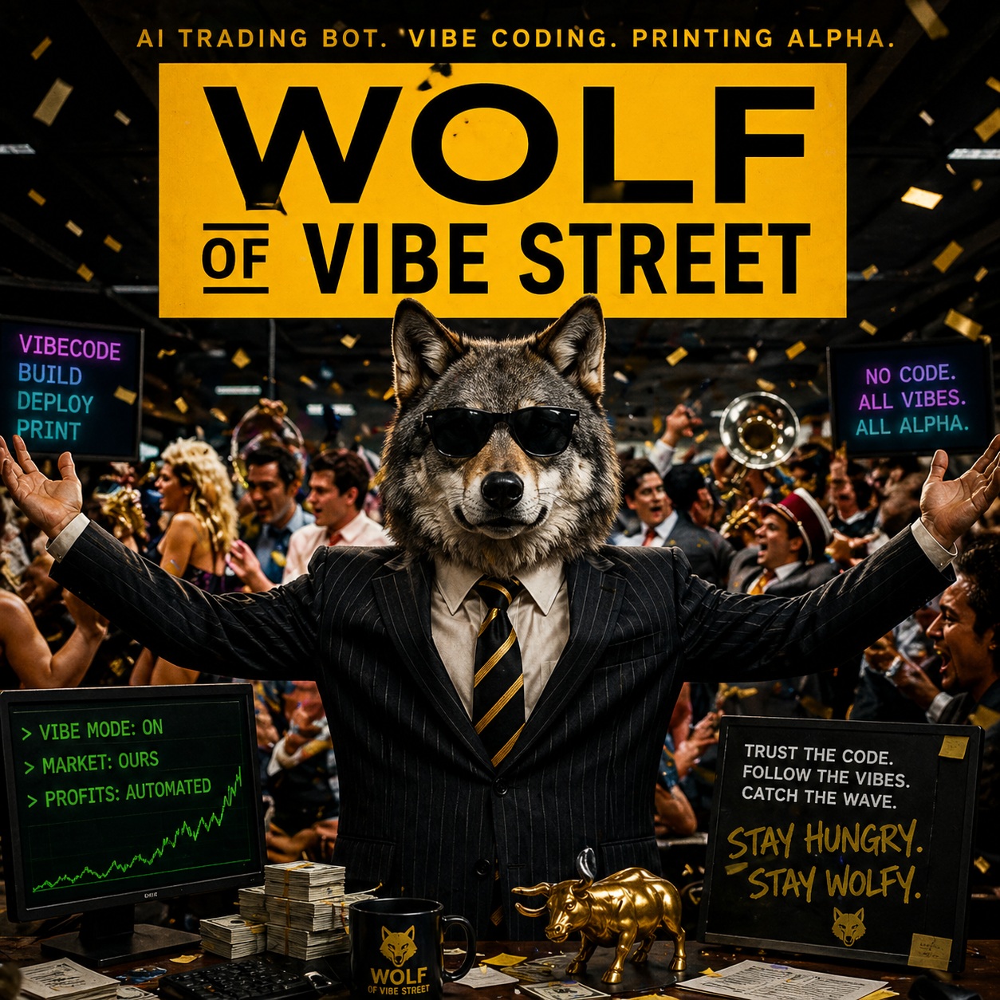

<div align="center">

# 🐺 Wolf Of Vibe Street



**A disciplined, emotionless, paper-first AI/agent crypto trading bot.**
Built in one night, vibe-coded together with [Claude Code](https://claude.com/claude-code).

[](https://github.com/dotsystemsdevs/wolf-of-vibe-street/actions/workflows/ci.yml)
[]()
[]()

</div>

---

## What this is

A real, working algorithmic trading bot that:

- **Pulls live market data** from Binance (CCXT, public REST).
- **Generates trading signals** with EMA crossover + ATR stops (the boring baseline).
- **Filters signals through Claude** as an LLM evaluator (S-33 hybrid pattern).
- **Sizes positions** with fixed-% risk + hard caps (kill switch, daily DD halt).
- **Executes paper orders** with realistic commission + slippage modeling.
- **Logs every decision** to an append-only SQLite audit trail.
- **Surfaces it all** in a dark-themed dashboard you start/stop from the browser.

Mantra (from `memory-bank/@design-doc.md`): *"Boring + alive > clever + dead."*

**Paper trading by default.** Real money uses Kraken with several interlocks (`LIVE_TRADING`, session gate, kill switch). See the operator checklist: **[`docs/GO_LIVE.md`](docs/GO_LIVE.md)** — from Kraken KYC to dry-run, calibration (first 30 fills), and `TRADERBOT_TRADE_MODE=live` promotion after the dashboard button. At the end of that doc, **Code vs operator — what's left** spells out what the repo already covers vs what only you can do (KYC, keys, money, live validation).

**External research (not dependencies):** comparable AI-trading projects are listed in [`knowledge.md`](knowledge.md) **§9.5** and in the dashboard sidebar **Referens-repos (AI-trading)**.

---

## Quick start

One command:

```bash
./dev-start.sh
```

Opens <http://localhost:8501>. Click **Start loop** in the sidebar. Done — bot is running.

For the full setup (uv, Python 3.12+, optional Telegram alerts), see below.

---

## Architecture

```
Binance API ─► data/binance.py ─► Parquet ──┐
                                             ├─► features ─► strategies ─► signals
News (TBD)  ─► …                       ──────┘                       │
                                                                      ▼
                                              risk caps ──────► Executor ──────► PaperBroker
                                                                      │
                                                                      ▼
                                                          decision_log (SQLite, append-only)
                                                                      │
                                                  ┌───────────────────┼───────────────────┐
                                                  ▼                   ▼                   ▼
                                            dashboard           text report          Telegram alerts
```

Five separate concerns. The decision log is the source of truth. The dashboard reads it.
The live loop writes to it via the executor.

---

## Layout

```
traderbot/
├── data/binance.py          OHLCV fetcher (CCXT)
├── data/backfill.py         Paginated historical pulls
├── data/store.py            Parquet save/load
├── features/compute.py      EMA / RSI / ATR / vol regime — all causal
├── strategies/
│   ├── baseline_ema_cross.py    Trivial EMA crossover (the floor)
│   ├── mean_reversion_rsi.py     RSI mean-reversion baseline
│   ├── conviction_filtered.py   Deterministic conv≥threshold filter (backtest stand-in for LLM filter)
│   └── llm_filtered.py          Wraps any strategy with an LLM evaluator (S-33)
├── agents/llm_evaluator.py  Claude evaluator + RuleBased mock
├── signals/types.py         Signal dataclass (validates: buy → stop required)
├── risk/
│   ├── sizing.py            Fixed-% risk, hard cap 1%
│   └── caps.py              Kill switch + DD halts + max positions/notional
├── execution/
│   ├── broker.py            Order/Fill/Position + Broker Protocol
│   ├── ccxt_paper.py        PaperBroker (sim fills + slippage + fee)
│   ├── ccxt_kraken.py       Kraken (optional; dry-run + userref idempotency)
│   ├── reconcile.py         Broker vs log on startup
│   └── runner.py            Executor — bar-driven, single-position
├── backtest/
│   ├── engine.py            Walk-forward, cost-aware
│   ├── metrics.py           Sharpe / Sortino / max DD / BE_WR
│   └── compare.py           Multi-symbol side-by-side + `STRATEGIES` registry
├── docs/
│   └── GO_LIVE.md           Operator checklist (Kraken, soak, promotion)
├── memory/decision_log.py   SQLite append-only (UPDATE/DELETE blocked by triggers)
├── workers/live_loop.py     Polls Binance → writes new bars → calls Executor
├── tools/notifier.py        Telegram + NoOp
├── tools/loop_control.py    Start/stop/status the loop subprocess
├── tools/env_config.py      .env reader/writer (preserves other lines)
├── ui/views.py              Pure summary functions (testable, no Streamlit)
├── ui/dashboard.py          Streamlit page
└── ui/report.py             Text-mode CLI summary
```

Read `CLAUDE.md` for operating rules, `memory-bank/@architecture.md` for invariants, `memory-bank/@design-doc.md` for what + why.

---

## What you can do — entirely from the browser

| Action | Where |
|---|---|
| Start / stop the bot | Sidebar → **LIVE LOOP** |
| Pause without stopping | Sidebar → **Kill switch** |
| P&L, positions, equity, trade history (25 rows) | **DESK** tab |
| **TAPE** — full decision log in a dense, filterable data grid (Excel-lik) | **TAPE** tab |
| **MAP** — ASCII + mermaid system map of the whole stack | **MAP** tab |
| Multi-symbol backtest + strategy compare (EMA, mean-reversion, + conviction-filter variants) | **COMPARE** tab |
| Soak health | Top of **DESK** (green / yellow / red banner) |
| Go live (dry-run → real) + calibration / promote | Sidebar expanders (see `docs/GO_LIVE.md`) |
| Telegram, Kraken keys, LLM filter, launchd | Matching sidebar expanders |
| Research links (Vibe, TradingAgents, …) | Sidebar → **Referens-repos (AI-trading)** |
| Loop stdout | **DESK** → Activity → **LOOP STDOUT** |
| Reset for a clean soak | Sidebar → **RESET FOR FRESH SOAK** |

---

## Documentation

| Doc | Use |
|-----|-----|
| [`CLAUDE.md`](CLAUDE.md) | How we work — rules, test policy, file map |
| [`knowledge.md`](knowledge.md) | Domain + **§9** cross-repo patterns + **§9.5** curated links |
| [`experiences.md`](experiences.md) | Pitfalls (P-*) and success factors (S-*) |
| [`docs/GO_LIVE.md`](docs/GO_LIVE.md) | Step-by-step from KYC to first real order |
| [`memory-bank/@architecture.md`](memory-bank/@architecture.md) | Invariants and layout |
| [`JOURNEY.md`](JOURNEY.md) | Build diary |

---

## Setup (first time)

```bash
git clone https://github.com/dotsystemsdevs/wolf-of-vibe-street.git
cd wolf-of-vibe-street
uv sync
cp .env.example .env  # fill in TELEGRAM_BOT_TOKEN if you want alerts
uv run pytest
./dev-start.sh
```

To run the same steps as [GitHub Actions](.github/workflows/ci.yml) (ruff, format check, pytest with coverage): `./scripts/check-ci.sh`.

Open <http://localhost:8501>.

### Optional config (env vars)

| Var | Default | Purpose |
|---|---|---|
| `TRADERBOT_SYMBOL` | `BTC/USDT` | What to trade |
| `TRADERBOT_STRATEGY` | `baseline_ema_cross` | Strategy id (see `backtest/compare.py` `STRATEGIES`) |
| `TRADERBOT_TIMEFRAME` | `1h` | Bar size |
| `TRADERBOT_INITIAL_CASH` | `10000` | USD |
| `TRADERBOT_RISK_PCT` | `0.005` | 0.5 % per trade (cap 1 %) |
| `TRADERBOT_POLL_INTERVAL_S` | `30` | Binance polling cadence |
| `TRADERBOT_BROKER` | `paper` | `paper` or `kraken` (needs `LIVE_TRADING=true`) |
| `TRADERBOT_TRADE_MODE` | — | On Kraken: unset = calibration caps; `live` = full caps after promotion |
| `KRAKEN_DRY_RUN` | `true` | With Kraken: synthetic fills until you disable |
| `TELEGRAM_BOT_TOKEN`, `TELEGRAM_CHAT_ID` | — | Both required for Telegram alerts |
| `ANTHROPIC_API_KEY` | — | For Claude LLM evaluator + optional `TRADERBOT_USE_LLM_FILTER` |

Copy [`.env.example`](.env.example) to `.env` and extend as needed. Full go-live env story: **`docs/GO_LIVE.md`**.

### Pause / kill switch

```bash
touch data/state/KILL_SWITCH       # bot pauses (doesn't exit)
rm   data/state/KILL_SWITCH        # bot resumes
```

Or use the sidebar toggle.

---

## Tech stack

- **Python 3.12+** with `uv` for package management
- **CCXT** for exchange APIs (Binance OHLCV; Kraken when `TRADERBOT_BROKER=kraken`)
- **pandas + pyarrow** for data + Parquet
- **SQLite** for the decision log (append-only via triggers)
- **Streamlit + Plotly** for the dashboard
- **Anthropic SDK** for the Claude evaluator
- **pytest** + **ruff** + GitHub Actions CI

---

## The journey

This bot was built in **one night, ~26 sessions**, from an empty folder to a running paper-trading system. See [JOURNEY.md](JOURNEY.md) for the day-by-day diary.

---

## License

MIT — do whatever you want, but don't blame me if the bot loses (paper) money.

**It is not financial advice. It is paper trading. Caution > cleverness.**
